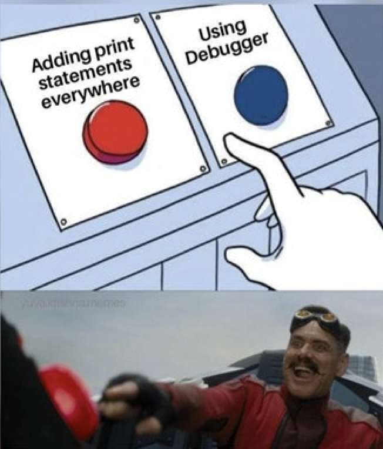

# Hi, I'm Shikhar

Aspiring AI Engineer | Agentic AI Builder | RAG & LLM Systems

> “I don’t just call models, I design agents that think, plan, and act.”

  
  
  
  

---

### 🌱 Currently Exploring

- **Agentic AI Architectures** (Multi-agent orchestration)
- **RAG Pipelines** (Advanced retrieval w/ Vector DBs)
- **Model Context Protocol (MCP)** & Tool-using Agents
- **LangChain / LangGraph** & LLM Deployment

---

### Tech Stack

| **Core** | **AI & Frameworks** | **Tools & Platforms** |
|:---:|:---:|:---:|
|           |                    |                    |

---

### Featured Work

- **Agentic AI Systems** — *Planning, reasoning, and tool-use implementation.*
- **RAG-based Knowledge Assistants** — *Context-aware systems using Vector DBs.*
- **LLM Dashboards** — *Interactive UI built with Streamlit & FastAPI.*

---

  

---

### GitHub Stats

  
<strong>Expand to see GitHub Stats & Snake</strong>

   
  

    <!-- Visitor Counter -->
    
      
    
    
     
    
     
    <picture>
      <source media="(prefers-color-scheme: dark)" srcset="https://github.com/Shikhaar/Shikhaar/raw/output/github-contribution-grid-snake-dark.svg">
      <source media="(prefers-color-scheme: light)" srcset="https://github.com/Shikhaar/Shikhaar/raw/output/github-contribution-grid-snake.svg">
      
    </picture>
  

---

  <h3>Fun Fact</h3>
  
<em>Most bugs aren’t bugs, they’re undocumented features waiting for an agent to debug them.</em>

   
  
Thanks for stopping by! Let’s build intelligent systems that actually think.

